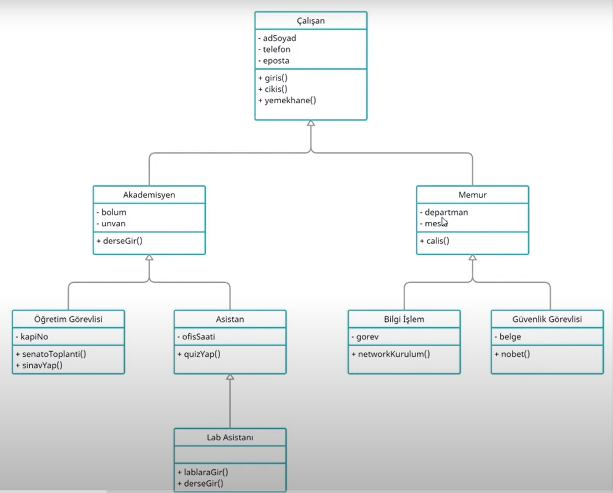

# Introduction
This application is the UML diagram of university employees, created in accordance with object-oriented programming principles.

## UML Diagram

## Explanation
Java language has been used in decoding this class diagram.

## Class Diagram
- The class named Workers is an abstract super class. The Academician and Officer class have been extended from it. It has 3 private attributes and 3 public methods.

- The class named Academician is an abstract sub class. The Lecturer and Assistant class have been extended from it. It has 2 private attributes and 1 public methods.

- The class named Lecturer is a concrete sub class. It has 1 private attribute and 2 public methods.

- The class named Assistant is a concrete sub class. The LabAssistant class have been extended from it. It has 1 private attributes and 1 public method.

- The class named LabAssistant is a concrete sub class. It has 2 public methods. The lessonGir() method has been overridden from the Academician class.

- The class named Officer is an abstract sub class. It has 2 private attributes and 1 public method.

- The class named InformationProcessor is a concrete sub class. It has 1 private attribute and 1 public method.

- The class named SecurityGuard is a concrete sub class. It has 1 private attribute and 1 public method.

